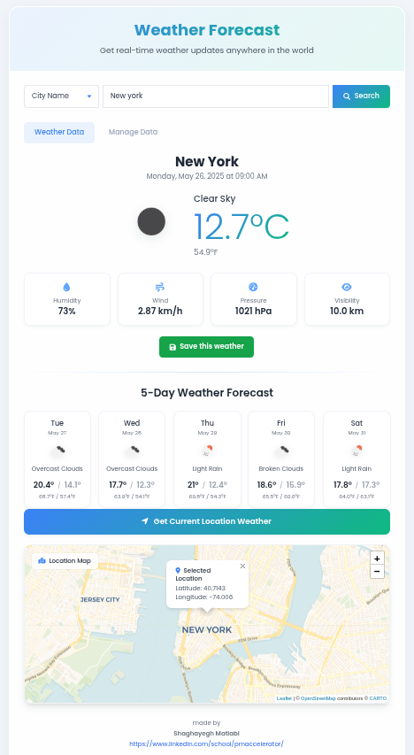

# 🌤️ Weather App



---

## 🚀 Introduction

Welcome to **Weather App** — a modern, responsive web application providing real-time weather updates and news tailored to your location.

Built with:

- **FastAPI** backend serving a powerful and efficient API  
- Beautiful **TailwindCSS** frontend for smooth user experience  
- Interactive **Leaflet.js** maps for location visualization  
- Integration with **OpenWeatherMap** & **NewsAPI** for accurate weather and news data  

Whether you want to check current weather, forecast, or local news — this app has you covered.

---

## ✨ Features

- Search weather by city name, postal code, or geographic coordinates  
- 5-day detailed weather forecast with temperature and conditions  
- Interactive map showing your selected location  
- Local news panel with latest news from the searched city  
- Manage (CRUD) your saved weather data  
- Export weather data in JSON, CSV, or PDF formats  
- Responsive design for desktops and mobiles  

---

## 🛠️ Technologies Used

| Layer         | Technology           |
|---------------|---------------------|
| Backend       | FastAPI, SQLAlchemy  |
| Frontend      | HTML, TailwindCSS, Leaflet.js, FontAwesome |
| Data Storage  | SQLite               |
| Utilities     | httpx, FPDF          |
| Containerization | Docker             |

---

## 📋 Prerequisites

- Python 3.11 or higher  
- Docker (optional but recommended)  
- API keys from:  
  - [OpenWeatherMap](https://openweathermap.org/api)  
  - [NewsAPI](https://newsapi.org/)  

---

## 🏗️ Installation & Setup

### 1. Clone the repository

```bash
git clone https://github.com/shgyg99/Weather-App.git
cd Weather-App
````

### 2. Create API keys configuration file

> ⚠️ **Important**
> The API keys file (e.g., `config.py`) is **excluded from the repository** for security reasons via `.gitignore`.
> After cloning, you must **create this file manually** to provide your API keys.

Create a `config.py` file in the project root with the following content:

```python
openwether = "YOUR_OPENWEATHERMAP_API_KEY"
news = "YOUR_NEWSAPI_API_KEY"
```

Replace the placeholders with your actual API keys.

---

### 3. Create & activate a Python virtual environment

```bash
python -m venv venv
source venv/bin/activate       # Linux/MacOS
venv\Scripts\activate.bat      # Windows
```

---

### 4. Install Python dependencies

```bash
pip install -r requirements.txt
```

---

## ▶️ Running the Application Locally

```bash
uvicorn main:app --reload
```

Open your browser and visit: [http://localhost:8000](http://localhost:8000)

---

## 🐳 Running with Docker

### Build the Docker image

```bash
docker build -t weather-app .
```

### Run the Docker container

```bash
docker run -d -p 8000:8000 --name weather-container weather-app
```

Open [http://localhost:8000](http://localhost:8000) in your browser.

> **Note:** Ensure your `config.py` file with API keys is available inside the Docker build context.
> If it’s not copied by default, you may need to mount it as a volume or include it in your Dockerfile.

---

## 🔎 API Endpoints

| Endpoint               | Method              | Description                                   |
| ---------------------- | ------------------- | --------------------------------------------- |
| `/weather`             | GET                 | Get weather by city, postal code, or coords   |
| `/local-news`          | GET                 | Fetch local news for a given city             |
| `/weather-db`          | GET/POST/PUT/DELETE | CRUD operations on saved weather data         |
| `/weather-db/download` | GET                 | Export saved weather data (json, csv, pdf)    |
| `/reset-db`            | POST                | Reset the database (drops & recreates tables) |

---

## 🎬 Demo


---

## 📄 License

This project is licensed under the MIT License.

---

## 👩‍💻 Author

**Shaghayegh Matlabi**
[LinkedIn](https://www.linkedin.com/in/shgyg99) | [GitHub](https://github.com/shgyg99)

---

Thank you for checking out the Weather App!
Feel free to contribute or open issues.

```
